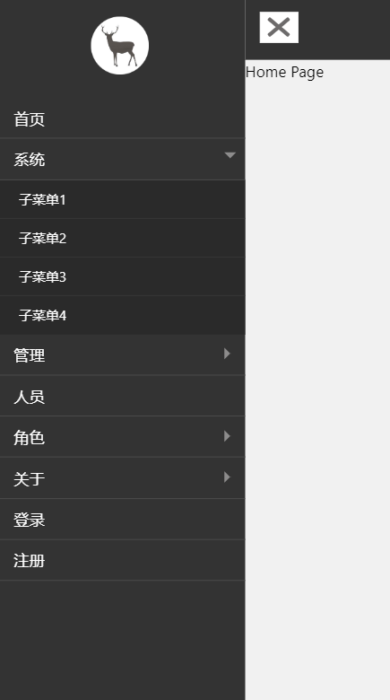

# React Moblie Menu
> React移动端菜单.


## Build Setup

``` bash


# creat app
create-react-app my-app

# cd app folder
cd my-app/

# serve with hot reload at localhost:3000
npm start
```
## Demo
- [demo](https://www.shaozecai.com/github/react/mobile-menu)

## View



## Tools
- [React](https://react.docschina.org/) - React 使创建交互式 UI 变得轻而易举。为你应用的每一个状态设计简洁的视图，当数据改变时 React 能有效地更新并正确地渲染组件。

## Author
- Email - admin@shaozeci.com
- Web site - https://shaozecai.com

## Version
- v1.0.1 支持三级菜单